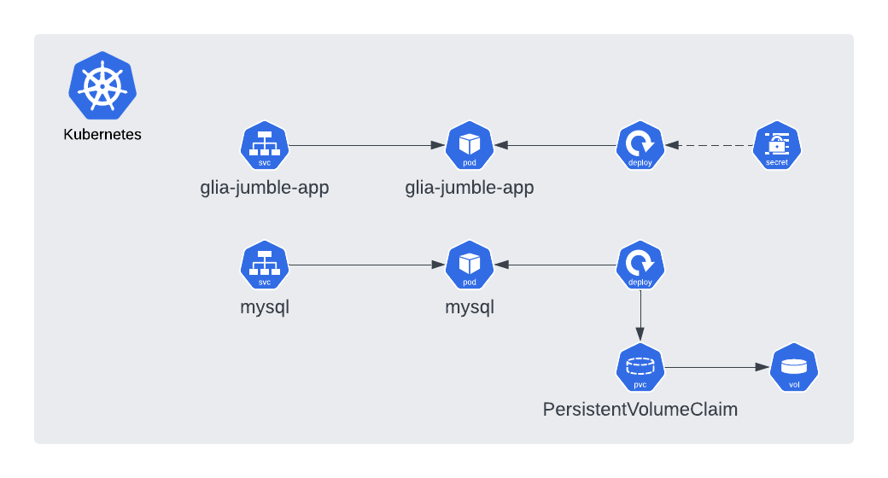

# Glia assessment


# Python FastAPI

This repository contains a Python FastAPI server containing the following endpoints:

* /jumble/ - Takes a word and re-arranges the characters randomly

* /audit - Return the last 10 API calls made to the server


The solution uses a mysql container as database, which in turn uses a persistent volume claim and persistent volume, and an nginx ingress controller. These components are deployed as dependencies in the helm chart, so we don't need to manage and create extra charts.

The application is built as a container image. To build the image we can proceed with:
```
docker build -t progerjkd/glia-jumble .
```

## Scan for vulnerabilities:
```
docker scan progerjkd/glia-jumble
```


## Push image to docker hub
```
docker push progerjkd/glia-jumble 
```

# Deploy the solution to minikube

The diagram below ilustrates the kubernetes resources used in the helm chart.



We can launch the application in a local minikube cluster, by using the provided helm chart.
```
# start minikube
minikube start

# install the helm chart
helm install glia-jumble-app -f helm/glia-jumble/values.yaml helm/glia-jumble/
```

The above command creates a helm release called glia-jumble-app of the glia-jumble helm chart.

We can fetch the minikube IP and the service’s NodePort:
```
minikube service glia-jumble-app --url

http://127.0.0.1:64270
❗  Because you are using a Docker driver on darwin, the terminal needs to be open to run it.
```

As the mysql server may take some time to be ready, the application may fail to connect until it establishes the database connection.
We can check for the pods status by using kubectl.
```
kubectl get pods  -w
```


# Testing

To test the application we can access the exposed service (using the port from the above command):

http://127.0.0.1:64270/jumble/word_to_be_jumbled

We get:

{"jumbled":"te_owdb__ubodmjler"}

We can visit the /audit endpoint to check the last requests to the server:

http://127.0.0.1:64270/audit
```
[{"id":13507,"timestamp":"2023-02-23T04:33:31","url":"http://10.244.0.85:8000/","payload":"/","status":200,"duration":4.485},{"id":13506,"timestamp":"2023-02-23T04:33:31","url":"http://10.244.0.85:8000/","payload":"/","status":200,"duration":0.246},{"id":13505,"timestamp":"2023-02-23T04:33:26","url":"http://127.0.0.1:64270/audit","payload":"/audit","status":200,"duration":96.827},{"id":13504,"timestamp":"2023-02-23T04:33:21","url":"http://10.244.0.85:8000/","payload":"/","status":200,"duration":16.78},{"id":13503,"timestamp":"2023-02-23T04:33:21","url":"http://10.244.0.85:8000/","payload":"/","status":200,"duration":0.32},{"id":13501,"timestamp":"2023-02-23T04:33:11","url":"http://10.244.0.85:8000/","payload":"/","status":200,"duration":0.237},{"id":13502,"timestamp":"2023-02-23T04:33:11","url":"http://10.244.0.85:8000/","payload":"/","status":200,"duration":5.041},{"id":13500,"timestamp":"2023-02-23T04:33:01","url":"http://10.244.0.85:8000/","payload":"/","status":200,"duration":4.437},{"id":13499,"timestamp":"2023-02-23T04:33:01","url":"http://10.244.0.85:8000/","payload":"/","status":200,"duration":0.249},{"id":13498,"timestamp":"2023-02-23T04:32:51","url":"http://10.244.0.85:8000/","payload":"/","status":200,"duration":4.557}]

```

We may see requests to / due to the kubernetes readiness probe.


We can optionally scale the deployment glia-jumble-app:
```
kubectl scale --replicas=2 deployment glia-jumble-app
```
